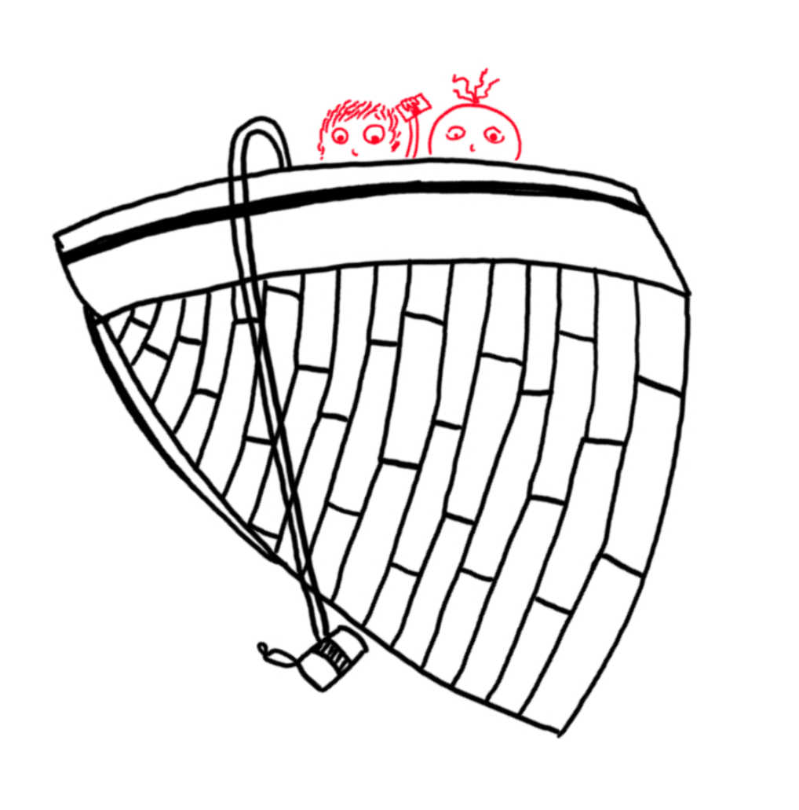

> Era un aire suave de pausados giros, era la tarde y la hora, era del año la estación florida, era el Verbo (en el principio), era un hombre que se creía un hombre. Qué burrada infinita, madre mía.
> *Rayuela, Capítulo 93*.

> El que mucho abarca poco aprieta.
> *Refrán popular*.

El desarrollo de la palabra escrita marca un punto de inflexión en la historia. La emergencia de la escritura en distintas culturas esparcidas por todas las latitudes y longitudes permitió materializar ideas y hacerlas perdurar. Abrió la puerta a la reproducción en masa, aumentó la distancia entre el locutor y su audiencia, y con ello, la diversidad interpretativa. Asumiendo la escritura como medio de perdurar la información, el presente se puede interpretar como su punto de máximo desarrollo: nuestras tecnologías codifican y almacenan miles de millones de caracteres, de sonidos y de figuras en dispositivos diminutos, más pequeños que una moneda, que nos otorgan una pluralidad de artefactos para crear, modificar e interactuar con esta información.

Nos hallamos invadidos y rebasados, navegando el internet como en un inmenso mar de contenido, expresado en todo tipo de lenguajes y medios, al que podemos acceder en cualquier momento del día desde una microcomputadora de bolsillo: transferencia inmediata de cualesquiera creaciones hasta el destino más recóndito del orbe. Las redes sociales, lucrando en grandes proporciones mediante una economía de la atención que nos mantiene enajenados consumiendo memes, fotografías y videos que olvidaremos en unas cuantas horas, no necesariamente por que esos objetos carezcan de valor, sino por la limitación humana de retener en la memoria tanta (y tan diversa) información. Cada día se vuelve más sencillo ahogarse en estas vastas e inconmensurables aguas virtuales.

Esto no es un efecto aislado: en un capitalismo cada vez más rapaz y despiadado, la oferta y el consumo se ha acelerado a niveles inimaginables. La globalización permite llevar bienes fabricados en condiciones de esclavitud a cualquier rincón del mundo, sin la incomodidad de dichos entornos de producción, comprados al mayoreo por el menor precio posible, engrosando los bolsillos de todos los intermediarios. El deterioro de la calidad de vida, donde nuestros escasos bienes se devalúan continuamente y la precarización laboral nos roba cada vez más tiempo, nos orilla al consumo de objetos efímeros, virtuales o materiales, que nos otorgan un poco de dopamina y distraen nuestra atención de la sórdida realidad: el mundo y la vida se agotan a cuenta gota en ciclos de producción y consumo que nos rebasan y nos conducen a un desenlace fatal.

Todas las artes, todos los productos culturales, han sufrido las consecuencias de esta aceleración en los métodos de consumo. La música, quizá debido a su estrecha relación con la tecnología, aparece como la gran perdedora de este cambio de paradigma. Cuando más del 80% del ingreso generado por la música es a través plataformas de streaming, que pagan a los artistas regalías que se asemejan más a una limosna que a una remuneración (ya ni se diga que esta sea justa), la vida del músico moderno se vuelve cada vez más dependiente de la viralidad y el consumo fugaz. Atrás quedaron las épocas en las que una artista podía desarrollar una carrera a lo largo de varios años, con algunos discos, giras, tal vez distintas agrupaciones y desarrollando un género y un estilo personal, con tropiezos y, si la fortuna lo permite, con algunas inversiones fallidas.

Desde esta trinchera, nos manifestamos en completo desacato tanto con esta cultura como con el nihilismo humildemente representado en el coloquial “¿y yo que puedo hacer?”. Este espacio se plantea como un lugar de reflexión y resistencia contra esta decadente cultura de consumo a través de la escritura de pequeñas prosas que inviten a escuchar la música y no a simplemente masticar y digerir a medias. Buscamos crear una comunidad en la que todas las expresiones sonoras sean válidas, sean éstas discos, EPs, mixtapes, DJ sets, videos, fragmentos, o cualquier otro objeto auditivo. A su vez, queremos también revalorizar a lxs artistas como creadores de paisajes sonoros capaces de transportarnos fuera de nuestra cotidianidad. Pretendemos ser una embarcación que se mueve a una confortable velocidad sobre el piélago multimedia, llevando a la superficie objetos que se están hundiendo, iluminando con nuestro humilde faro buques que navegan solos, explorando con calma algunas islas y archipiélagos, e intercambiando con cuantos quiera navíos que se acerquen.

	

